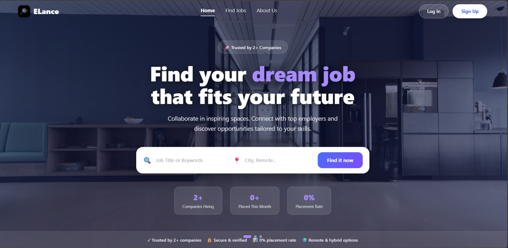
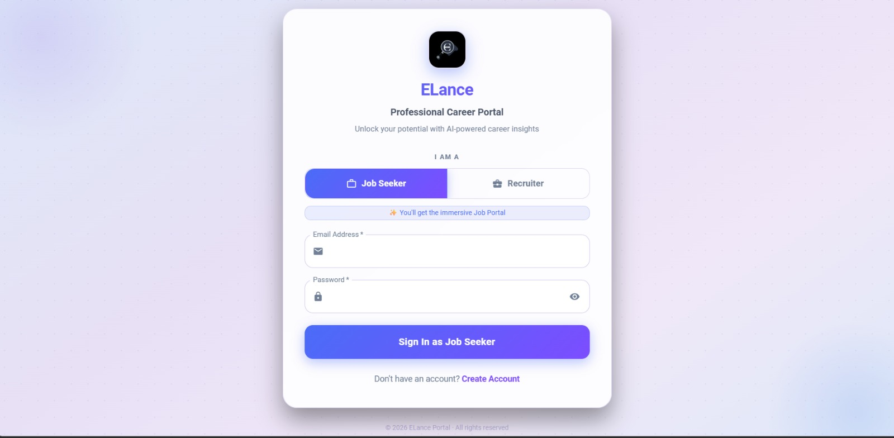

# 🚀 Elance – AI Powered Job Recommendation Portal

MERN Stack | AI Powered Recruitment Platform | Dual Dashboard System

Elance is a **full-stack MERN job recommendation platform** designed to simplify the hiring process for both **Job Seekers** and **Recruiters**.
The platform provides a smart and user-friendly environment where job seekers can discover relevant opportunities and recruiters can efficiently manage job postings and applicants.

This project demonstrates the implementation of a **dual-dashboard recruitment system** built using the **MERN stack**.

---

# 🌟 Features

## 👨‍💻 Job Seeker Dashboard

* User registration and secure login
* Browse available job opportunities
* Receive personalized job recommendations
* Apply to jobs directly through the platform
* Manage and track applied jobs

## 🏢 Recruiter Dashboard

* Recruiter account registration and authentication
* Post new job openings
* Manage job listings
* View and manage applicants
* Simplified hiring workflow

---

# 🛠 Tech Stack

### Frontend

* React.js
* JavaScript
* HTML5
* CSS3

### Backend

* Node.js
* Express.js

### Database

* MongoDB

### APIs & Integrations

* AI APIs for enhanced job recommendations
* RESTful API architecture

---

# 📂 Project Structure

```
Elance
 ├ backend
 │   ├ controllers
 │   ├ routes
 │   ├ models
 │   └ server.js
 │
 ├ frontend
 │   ├ components
 │   ├ pages
 │   └ services
 │
 ├ screenshots
 │   ├ login.png
 │   ├ jobseeker-dashboard.png
 │   ├ recruiter-dashboard.png
 │   └ job-recommendations.png
```

---

# 📸 Project Screenshots

## Landing Page


## Login Page


## Job Seeker Dashboard


---

# ⚙️ Installation & Setup

### Clone the repository

```
git clone https://github.com/Himanivashisht03/Elance.git
```

### Navigate to the project folder

```
cd Elance
```

### Install dependencies

```
npm install
```

### Run Backend

```
cd backend
npm start
```

### Run Frontend

```
cd frontend
npm start
```

---

# 🎯 Future Improvements
AR/VR Mock Interview System – Conduct immersive AR/VR-based mock interviews where candidates can practice real-world interview scenarios in a virtual environment.
Deployment & Scalability Improvements – Deploy the platform on cloud infrastructure with optimized performance and scalability.
---

# 👩‍💻 Author

**Himani Vashisht**

Computer Science Student | MERN Stack Developer

GitHub:
https://github.com/Himanivashisht03

---

# ⭐ If you like this project

Please consider giving it a **star on GitHub**.
